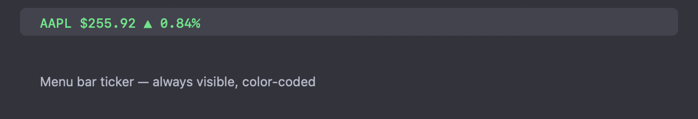
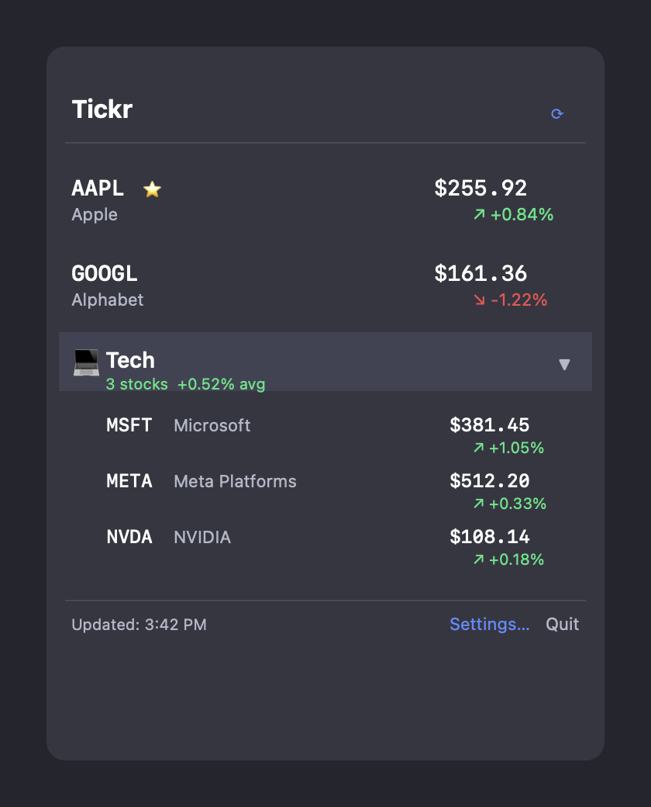
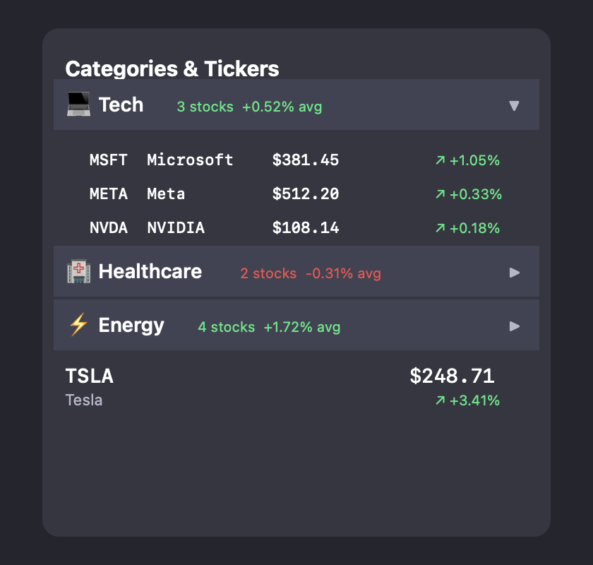
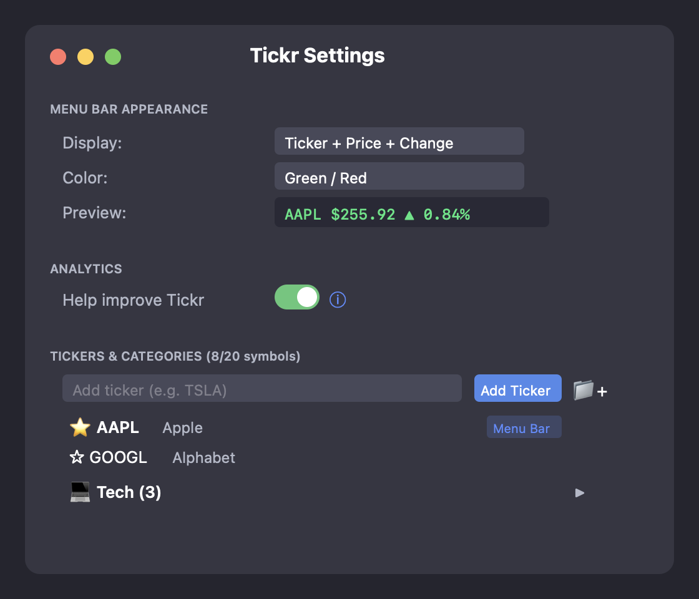

# Tickr

A lightweight macOS menu bar app that displays real-time stock prices. Organize unlimited tickers into categories, view charts, news, earnings dates, and market data — all from your menu bar.


**[Download Latest DMG](../../releases/latest/download/Tickr.dmg)**

## Screenshots

### Menu Bar


Your primary stock ticker lives in the macOS menu bar — always visible with color-coded price changes.

### Dropdown


Click the menu bar item to see all your stocks. Single tickers and collapsible categories in one view.

### Categories


Organize tickers into categories (Tech, Healthcare, Energy, etc.) — expand to see individual stocks, collapse to save space.

### Settings


Configure display format, colors, refresh interval, analytics preferences, and manage your tickers and categories.

## Features

- **Menu Bar Ticker** — Shows your primary stock with live price and change directly in the macOS menu bar
- **Categories** — Group stocks into collapsible categories (Tech, Healthcare, Energy, etc.) with average performance
- **Single Tickers** — Add individual stocks outside of any category
- **Color-Coded Changes** — Green (▲) for gains, Red (▼) for losses, or grey monochrome mode
- **Display Options** — Ticker + Price, Company + Price, Price Only, with/without trend arrows and percentages
- **Configurable Refresh** — Update intervals from 15 seconds to 30 minutes
- **Click to Open** — Click any stock to open its Yahoo Finance page
- **Category Icons** — 15 icons to choose from (laptop, building, bolt, globe, etc.)
- **Zero Dependencies** — Pure Swift/SwiftUI, no external packages
- **Privacy Focused** — Transparent, opt-out analytics; no accounts; no personal data

## Installation

### Download DMG

1. Download the latest `Tickr.dmg` from [Releases](../../releases)
2. Open the DMG file
3. Drag **Tickr** to your **Applications** folder
4. Launch Tickr from Applications

> **Note:** On first launch, macOS may show a security prompt. Go to **System Settings > Privacy & Security** and click "Open Anyway."

### Build from Source

```bash
# Clone the repository
git clone https://github.com/h4ux/Tickr.git
cd Tickr

# Set up secrets (optional — for analytics)
cp Tickr/Services/Secrets.example.swift Tickr/Services/Secrets.swift
# Edit Secrets.swift with your PostHog API key, or leave placeholder to disable analytics

# Build and create DMG
./scripts/build_dmg.sh
```

**Requirements:**
- macOS 13.0 (Ventura) or later
- Xcode Command Line Tools or Xcode 15.0+

## Usage

1. **Launch** — Tickr appears in your menu bar with the default ticker (AAPL)
2. **Click** the menu bar item to see all watched stocks and categories
3. **Expand** a category to see its stocks; click any stock to open Yahoo Finance
4. **Settings** — Click "Settings..." to configure:
   - Display format and colors for the menu bar ticker
   - Add single tickers or create categories with icons
   - Choose which ticker shows in the menu bar
   - Adjust refresh interval
   - Toggle analytics on/off with full transparency
5. **Quit** — Click "Quit" in the dropdown

## Analytics

Tickr includes **opt-out** anonymous analytics to help improve the app. Click the **(i)** info button in Settings to see exactly what is tracked:

- **Events:** app opened, stock added/removed, category created
- **Properties:** country (from locale), app version, macOS version
- **Not tracked:** IP address, email, name, financial data, browsing

Toggle off "Help improve Tickr" in Settings to disable all tracking. See [SECURITY.md](SECURITY.md) for details.

## Data Source

Stock quotes are fetched from Yahoo Finance's public API. No API key is required. Data may be delayed up to 15 minutes depending on the exchange.

## Architecture

```
Tickr/
├── TickrApp.swift                  # App entry point, AppDelegate
├── Models/
│   ├── StockData.swift             # Stock quote model + Yahoo Finance response
│   └── AppSettings.swift           # Settings, categories, display enums
├── Services/
│   ├── StockService.swift          # Yahoo Finance v8 API client
│   ├── AnalyticsService.swift      # PostHog analytics (opt-out)
│   ├── Secrets.swift               # API keys (git-ignored)
│   └── Secrets.example.swift       # Template for Secrets.swift
└── Views/
    ├── StatusBarController.swift   # Menu bar item + popover
    ├── TickerDropdownView.swift    # Dropdown with categories + stock rows
    └── SettingsView.swift          # Settings window + analytics info
```

## Contributing

Contributions are welcome! Please read [CONTRIBUTING.md](CONTRIBUTING.md) for guidelines.

## Security

For security concerns, please see [SECURITY.md](SECURITY.md).

## License

This project is licensed under the MIT License — see [LICENSE](LICENSE) for details.
